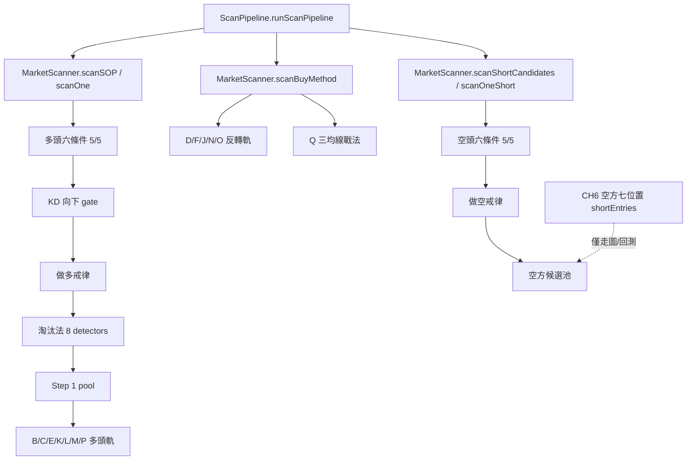

# 2026-08-05 朱家泓教材規則到 RockStock 程式深度稽核

## 結論先行

RockStock 並不是「完全沒做朱老師系統」；相反地，多頭六條件、七個做多位置、停損、持倉與停利已經有大量實作。真正的風險是：**教材真意、舊書規則、回測後產品決策、自創量化與顯示提示，仍混在不同執行路徑中**。因此同一檔股票可能在掃描、走圖、每日持股建議與 AI 問答得到不同答案。

本輪沿真正的 runtime call chain 稽核後，確認最高優先的問題有四項：

1. **每日持股建議忽略 `operationMode`**：持倉明明保存短線／升級長線狀態，`v12-signals` 也會依狀態選 MA5、MA10、MA20，但 `daily-action` 沒把它傳入 `holdingsActionEngine`。同一持股可能在詳細面板與每日推播得到不同出場結論。
2. **空方七位置未接正式掃描**：CH6-8～CH6-14 的七個 detector 已存在，但目前只供走圖與回測；正式空方候選仍用舊版「空頭六條件」池，而且把量比 ≥1.3 設成硬門檻，會漏掉課程明說「不一定需要大量」的空點。
3. **AI 仍只讀舊整理**：聊天 runtime 只載入 `TECHNICAL_ANALYSIS_5STEPS.md` 與 `RockStar_5Steps_Framework_v12.md`，沒有讀最新 CH1–CH12 或本次 canonical 規格。
4. **淘汰法只有 8 個 hard detector**：最新課程拆分後有 15 個 reason code；現行 8 條中又有數條只是代理量化。部分缺項會被六條件先擋掉，但系統只回 `filteredOut`，沒有保留「為何被淘汰」的教材 reason code。

此外，名稱看起來較新的 `v12StockEvaluator.ts` **不是正式選股路徑**。正式掃描走 `ScanPipeline → MarketScanner`；前者目前只被研究、回填與回測腳本使用。任何只稽核 `v12StockEvaluator` 而宣稱「production 已完成」的舊報告，現況判斷都不可靠。

## 1. 稽核基準與限制

### 1.1 教材基準

本報告以 [朱家泓技術分析知識規格](../ZHU_TECHNICAL_KNOWLEDGE_SPEC_2026.md) 為教材真意層，來源優先順序為：

1. P0：2026 線上課程上下冊合集投影片。
2. P0.5：同課影片／逐字稿，只補口述，不覆蓋投影片明文。
3. P1：2024《活用技術分析寶典》。
4. P2：2017《做對 5 個實戰步驟》。
5. P3：其他朱老師舊書與林穎老師補充。
6. P4：RockStock 自創量化或回測後 production override。

### 1.2 程式快照

- 稽核基準分支：`feat/broker-reports-tracking`。
- 稽核開始時 HEAD：`e07d54b`。
- 同時檢查 2026-08-05 本機 working tree；該 working tree 有大量使用者未提交變更。
- 本輪不修改交易邏輯，只新增稽核文件。
- 因此本報告描述的是「目前本機程式快照」，不保證等於線上已部署版本。

### 1.3 判定標籤

| 標籤 | 定義 |
|---|---|
| `confirmed_defect` | 兩條正式路徑互相矛盾，或程式明確違反 P0 規則。 |
| `partial` | 已做部分語意，但條件、reason code 或使用範圍不完整。 |
| `production_override` | 刻意用回測／產品決策覆蓋教材，不冒充教材原文。 |
| `production_quantization` | 教材只講形狀或語意，程式自行選百分比、天數或容差。 |
| `data_limited` | 規則存在，但正式環境沒有穩定資料可判。 |
| `display_only` | 只出現在走圖／提示，不影響正式選股或動作。 |
| `source_metadata_defect` | 邏輯未必錯，但來源、註解或優先順序寫錯，容易造成下一次錯改。 |

## 2. 真正的正式執行鏈



確認證據：

- `lib/scanner/ScanPipeline.ts:205` 呼叫 `scanSOP`；`ScanPipeline.ts:400` 呼叫 `scanBuyMethod`。
- `lib/scanner/MarketScanner.ts:394–497` 是多頭實際 gate。
- `lib/scanner/MarketScanner.ts:845–962` 是空頭實際 gate。
- `lib/scanner/v12StockEvaluator.ts` 只被 `scripts/backtest-*`、回填腳本與測試引用。
- `lib/analysis/v12Signals.ts:4–14` 自己已標明 detector production 無人呼叫。

### 2.1 重要判定

`v12StockEvaluator` 的檔頭仍寫「給既有 ScanPipeline 呼叫」「適用 cron」，與現況不符；部分舊 audit 又曾把它稱作 production。這是 `source_metadata_defect`，也會讓不同模型稽核到不同答案。

建議把「正式路徑」做成機器可驗證的 architecture contract，而不是靠檔名或舊文件猜測。

## 3. P0／P1 高影響發現

| ID | 嚴重度 | 判定 | 已確認現況 | 實際影響 |
|---|---:|---|---|---|
| ZC-001 | P0 | `confirmed_defect` | `operationMode` 保存在 holding `ui`，`v12-signals` 會讀，但 `daily-action` 呼叫 `evaluateHolding` 時未傳。 | 已升級長線的部位仍可能被每日建議依 MA10／MA5 提前退出；面板與推播不一致。 |
| ZC-002 | P0 | `confirmed_defect` | `shortEntries.detectShortEntries` 七位置只被 `SixConditionsPanel` 與回測使用，正式空方 scanner 未呼叫。 | 正式候選無法回答「今天命中哪一個 CH6 空點」，也可能完全漏選。 |
| ZC-003 | P0 | `confirmed_defect` | 正式空頭池要求量比 ≥1.3；CH6-S1、S5 明確不要求量，S7 還有教材內部量能衝突。 | 無量但結構正確的空點被系統性排除。 |
| ZC-004 | P0 | `confirmed_defect` | `bookContextLoader` 只載入兩份舊文件。 | AI 問答不知道最新版 CH1–CH12 與已校正的 20%／15%、前日量／5 日均量差異。 |
| ZC-005 | P1 | `partial` | 最新淘汰法 15 reason code，正式 hard filter 只有 8 個 detector。 | 候選淘汰覆蓋與可解釋性不足，且「已實作」標籤容易過度宣稱。 |
| ZC-006 | P1 | `source_metadata_defect` | `bookThresholds.ts` 仍宣告「寶典 > 舊書」優先，未把 2026 課程置頂。 | 新增或重構門檻時容易再次用 P1 覆蓋 P0。 |
| ZC-007 | P1 | `partial` | N 型態軌混入舊書 8 型與達成率；最新版課程指定 6 種高勝率底部型態。 | 類型集合不同；UI 顯示的 75%、80%、85% 等有些是對稱推估或自訂，不是本課投影片數字。 |
| ZC-008 | P1 | `partial` | 缺明示 stopLoss 時，持股、匯入、即時守衛與 UI 多處 fallback 為成本 ×0.93。 | 最新課程「固定比例一般 5%」被舊 7% fallback 取代；真正策略停損資料遺失時不會 fail closed。 |
| ZC-009 | P1 | `source_metadata_defect` | `PROFIT_PARTIAL_TP_PCT=15%` 的註解宣稱 CH9 取代 CH8 20%。 | runtime 另有 20% 分支，行為尚未完全被覆蓋；但 canonical 註解錯誤，下一次重構可能把兩情境合併。 |
| ZC-010 | P1 | `confirmed_defect` | `daily-action` 與 `shadowLedger` 都不接 `operationMode`；影子帳本仍自稱「書本嚴格執行版」。 | 「紀律差額」可能拿錯持倉週期計算，屬呈現與決策品質缺陷。 |
| ZC-011 | P2 | `production_override` | 候選 universe 用 20 日平均成交額前 500；最終排序先看當日漲幅。 | 有回測／流動性理由，但不是最新課程「1,000 張、500 張彈性」與「接近發動」原文。 |
| ZC-012 | P2 | `production_quantization` | K 橫盤 5% 區間；M/N/O 真突破 3%；多項 5／10／20／60／120 日窗。 | 可作產品參數，但必須標示自創，不能回寫成朱老師明訂數字。 |
| ZC-013 | P1 | `confirmed_defect` | 多空 K 線橫盤 detector 都把 `MIN=3` 解讀成「錨點之後再 3 根」，而 P0 明確是「第一根包含在 3 根內」。 | 教材允許第 4 根突破／跌破，程式最快要到第 5 根，會漏掉最早的標準訊號。 |

## 4. 基礎判別點：趨勢、K 棒、均線、成交量

### 4.1 趨勢

現行 `detectTrend` 的核心方向正確：

- 以 MA5 正負區切分波段轉折。
- 至少需要兩個頭、兩個底。
- 多頭要求新頭突破、底不破；空頭要求新底跌破、頭不過。
- 收盤突破／跌破才確認結構改變。
- 頭高底低、頭低底高或結構不足都回盤整。

這一段可判為 `mostly_complete`。兩個需保留的實作決策：

1. 同價低點以 `>=` 視為「不破前底」，同價高點以 `<=` 視為「不過前頭」。這是 2026-05-10 的產品解釋，不是 epsilon 容差。
2. pivot 最多取近期 120 bars、趨勢至少需要 20 bars，屬 `production_quantization`。

### 4.2 K 棒

| 教材情境 | 教材值 | 現行用途 | 判定 |
|---|---:|---|---|
| CH2 長／最大棒分類 | 實體 >6.5% | 常數已建立，但不作一般進場 gate | 正確分離 |
| CH2 中棒分類 | 3.5%–6.5% | 常數已建立 | 正確分離 |
| 特定進場棒 | 實體 ≥2% | 多／空六條件與多數 detector | 大致符合 |
| 進場紅 K 上影 | 收盤在棒體有效位置 | `closePos >= 0.5` | 舊書補充，可保留 |
| CH9「長黑」 | 教材未另外印 2% | 程式用實體 ≥2% | `production_quantization`，不可稱 P0 明文 |

最大風險不是 6.5% 與 2% 共存，而是任何文件或程式把它們合成一個 `longCandleThreshold`。

### 4.3 均線與位置

多頭 Step 1 要求：

- `MA5 > MA10 > MA20`；三線當日都上升。
- 收盤同時高於 MA10、MA20。
- MA20 正乖離不超過 15%。

前兩項與課程六條件方向相符；第三項是來源情境混用：最新版規格的 15% 主要屬葛蘭畢逆勢買 4／賣 8 與高乖離警示，不是所有順勢進場的通用硬 gate。現行 15% 應標成 `production_override`，不可標成 P0 exact。

空頭側除了鏡像條件，還額外要求完整 `MA5 < MA10 < MA20`、MA5 下彎與價格乖離 <15%；它比 CH6 七空點共同底座更嚴，適合「空頭候選品質池」，不應冒充全部空方進場位置。

### 4.4 成交量

現行至少存在四套不同量能口徑：

| 用途 | 現行口徑 | 教材對照 | 判定 |
|---|---|---|---|
| 多頭 Step 1 | 今日／前日 ≥1.2 | CH1-5 特定高勝率起漲棒 | 符合使用者既有裁決 |
| 個別 B/C/J/K/L/M/N/P | 多數今日／前日 ≥1.3 | P1 寶典與部分課程段落 | 較嚴的舊書 overlay |
| CH4 攻擊量 | 應比較 5 日均量約 1.2–1.3 | 最新課程 CH4 | 並非 Step 1 的 denominator |
| 爆量／出貨 | 5 日均量或前日 ×1.5、×2，部分 2–5 倍 | 高檔量價情境 | 必須依 detector 保留 context |

現況沒有「所有量比都寫錯」，但變數名稱 `BOOK_VOL_RATIO_MIN` 太容易跨 denominator 誤用。結構化 registry 必須同時保存 `numerator`、`denominator`、`context` 與 `confirmation_time`。

## 5. CH5 選股與淘汰法覆蓋

### 5.1 候選 universe 與排序

- TW 股價 <5 元已在 `TurnoverRank` 排除，符合課程。
- 正式 universe 是 20 日平均成交額前 500，不是日成交量 1,000 張門檻；此為回測／流動性產品決策。
- Step 1 候選需六條件前五項全過，再過 KD、戒律與淘汰法。
- 最終 panel 先按當日漲幅降序，再看六條件分數、MA20 斜率。
- 課程要求「接近發動程度」與持股 2–5 檔；目前只有排序 proxy，沒有明確的 `launch_readiness` reason model。

### 5.2 淘汰法 15 reason code 對照

| P0 reason | 正式覆蓋 | 判定／說明 |
|---|---|---|
| 001 尚未打底空頭 | `rule01` + 趨勢 gate | 有，但通常先被六條件擋掉。 |
| 002 多空未確認 | 趨勢 gate | 間接覆蓋，沒有獨立 reason。 |
| 003 上壓下撐區間 | 趨勢／戒律 7 | 間接覆蓋，沒有最新課程 reason。 |
| 004 上漲量縮／背離 | `rule04` 只擋量 <0.5×avg5 | `partial`，遠窄於教材語意。 |
| 005 漲一倍且頭頭低盤整 | `rule05` 用 60 日低點 ×2 + 盤整 | 大致覆蓋，60 日為量化。 |
| 006 高檔爆量後連 3 長黑 | `rule06` 改成 10 日內 2 根大量長黑 | `partial`，不是「連續三天」。 |
| 007 長期打底未過大量壓力 | `rule12` 40／120 日、avg5×2 | `partial`，量化已明示。 |
| 008 高檔爆量長黑 | `rule06` 要 10 日內至少 2 根 | `partial`，單根風險不會獨立淘汰。 |
| 009 跌破 MA20 且下彎 | Step 1 位置／均線 gate | 間接覆蓋，無淘汰 reason。 |
| 010 跌破前低 | 趨勢 gate + 戒律 6 | 間接覆蓋。 |
| 011 漲一倍且頭頭低 | `rule05` 還要求盤整 | `partial`。 |
| 012 MACD／KD 高點背離 | `rule07` 以今日對 5 日前比較 | `partial`；不是兩個結構高點一對一比較。 |
| 013 法人連賣 | avoidance 顯示層 | `data_limited`，不進 hard filter；傳入 `_ctx` 目前也未使用。 |
| 014 看不懂／疑慮多 | 未硬編 | 正確保留 `education_only`。 |
| 015 基本面好但技術空頭 | 趨勢 gate | 技術面可擋；「基本面好」資料不必進技術 gate。 |

另一個架構缺口是：`scanOne` 在每一層直接 `return null`，診斷只增加 `filteredOut`。因此被六條件先擋的股票，不會留下 `ZH-ELIM-009` 或 `ZH-ELIM-010` 等 reason code。若這些知識點要成為 RockStock 可學習、可審計的判別點，需要另建 rejection ledger，而不是只保存最後通過者。

## 6. CH6 做多七位置

| P0 位置 | 正式字母／detector | 覆蓋判定 | 主要差異 |
|---|---|---|---|
| L1 盤整突破 | C / `detectRangeBreakout` | `mostly_complete` | 額加至少 6 日、區間 ≤15%、頸線上揚容差等量化。 |
| L2 回後買上漲 | B / `detectPullbackBuy` | `mostly_complete` | 站回 MA5 後容許 0–2 日補量突破；另加 0.618 深度 gate。 |
| L3 K 線橫盤 | K | `partial` | 錨點已正確改成紅黑／實體不限；但程式要求錨點後再 3 根，教材是含錨點共 3 根，存在 off-by-one；5% 區間為自創。 |
| L4 六型態確認 | N，加上 D/O 部分分流 | `partial` | N 實際含 8 型，缺少一字底於同一 detector；另混入舊書達成率與 ×3% 真突破。 |
| L5 ABC 修正突破 | J | `mostly_complete` | 額加前波 ≥8%、修正 ≥3%、至少 6 日等防噪量化。 |
| L6 上升通道突破 | M | `partial` | 軌道幾何正確；收盤需超過上軌 3% 是舊書 overlay，P0 只要求收盤突破。 |
| L7 過大量黑 K 高 | L | `mostly_complete` | 三日窗符合；黑 K 實體 1.5%、量比 1.3 為具體化。 |

### 6.1 字母系統不是最新七位置的一對一字典

正式字母還包含 D、E、F、O、P、Q：一字底、缺口、V 反轉、打底完成、高檔淺回、三均線戰法。這些可作 P1–P3 補充，但 UI 與知識 registry 應明確標記來源，不應把 B～Q 全稱為「2026 線上課七位置」。

K 橫盤另有一個已確認的索引錯位：`KLINE_CONSOL_MIN_DAYS=3` 本身沒錯，但 `findAnchorAndRange` 用 `idx - MIN_CONSOL_DAYS - 1` 找最近錨點，等於要求「錨點 + 後續 3 根橫盤 + 今日突破」至少 5 根。合集 CH2-3 明確說三根包含第一根，第三根後即可突破，標準最短序列應是「錨點 + 2 根受約束 + 第 4 根突破」。空方 S3 使用相同的錨點後 3 根概念，也有同一個 off-by-one。

`bookThresholds.ts` 仍保留未使用的 `KLINE_CONSOL_ANCHOR_BODY_PCT=3`，但正式 K detector 已於 2026-07-12 移除錨點實體門檻。這個常數應標 deprecated 或刪除，避免下一位維護者誤以為 production 仍要求 3%。

### 6.2 N 型態與「達成率」

最新版 CH6-L4 明列：頭肩底、複式頭肩底、N 字底、三重底、圓弧底、一字底。

現行 N 另含下降楔形、跌菱形、雙重底，並顯示 36%～95% 達成率；其中 `n-shape=75%` 與多個頂部型態比率是保守估計或對稱推估。這些值會進 LockWatch payload 與 UI「達成率」展示。依 canonical 規格，圖例勝率沒有樣本、期間與計算方法時不可作可信機率。建議改名為 `legacy_book_claim` 或 `heuristic_rank`，禁止以校準後勝率呈現。

### 6.3 Q 三均線戰法

Q 確實來自舊書《抓住線圖》MA3／MA10／MA24，不是 2026 最新線上課主體。程式核心均線判斷大致忠於舊書；但 detector 註解一處說會套量 1.3，實際程式沒有量 gate，屬註解不一致。Q 應保留為獨立 P3 system track。

## 7. CH6 做空七位置

`lib/analysis/shortEntries.ts` 已實作 S1～S7，且註解清楚區分：

- S1、S5 不要求量。
- S6 明確要求大量。
- S7 量能有教材衝突。
- 每一位置回傳進場黑 K 高點停損。

但檔案自己也標示 `display_only`。全 repository 只有：

- `components/SixConditionsPanel.tsx`
- `scripts/backtest-short-entries.ts`

呼叫 `detectShortEntries`；`MarketScanner.scanOneShort` 沒有呼叫。

正式空方池目前只做：

1. 空頭趨勢。
2. 完整 MA5／10／20 空排與 MA5 下彎。
3. 價在 MA10／20 下、乖離 <15%。
4. 量比前日 ≥1.3。
5. 黑 K 實體 ≥2%。
6. 做空戒律。

這是一個嚴格的「空頭品質池」，不是 CH6 七位置掃描。若產品要以最新版課程為主，應把它拆為：

- `short_quality_context`：方向、MA20、位置、風險。
- `short_entry_reason`：S1～S7 至少一個命中。
- 各 S 規則自己的量能要求，不用一個全域 1.3 gate。

## 8. CH7 停損

### 8.1 做得正確的部分

- 進場 K 低點、pivot、結構支撐、操作均線等策略停損已按字母分流。
- 收盤確認停損。
- 10% 絕對停損已獨立於策略停損。
- 獲利 ≥7% 後才抬高到跟隨均線，正確表達「停損 → 移動停利」的狀態切換。
- 逆勢 D/F/N/O 有翻黑／轉空提前出場。
- 停損往不利方向放寬會留下紀律紅旗。

### 8.2 主要缺口

1. `v12StopLoss.updateStopLossDaily` 計算動態停損，但 `daily-action` 沒有走這條完整路徑，只用 holding 既存 `stopLoss` 加自己的出場規則。
2. 缺 stopLoss 時全域 fallback 7%，最新版課程的常用固定比例是 5%。7% 可作舊書／特定策略值，但不該在策略資料缺失時靜默冒充正確停損。
3. `SIGNAL_TO_FIXED_STOP_PCT` 對 D/N/O/Q 給 10%，是產品分流；需標 `production_override`，不是課程說反轉軌一律 10%。
4. 詳細 v12 面板算出的動態停損不會自動寫回 holding；每日守衛讀的可能仍是舊 stop。

建議停損資料模型至少保存：`strategy_stop`、`absolute_stop`、`active_stop`、`stop_state`、`source_rule_id`、`last_raised_at`，且停損只能單向收緊。

## 9. CH8–CH9 持倉與停利

### 9.1 已確認的雙路徑分歧

`app/api/portfolio/v12-signals/route.ts`：

- 讀 `operationMode`。
- 短線按字母選 MA3／MA5／MA10／MA20。
- 升級長線統一 MA20。
- 會計算長線升級資格與動態停損。

`app/api/portfolio/daily-action/route.ts → holdingsActionEngine`：

- 沒傳 `operationMode`。
- 引擎固定依獲利率同時檢查 MA10、MA20，再檢查 MA5。
- 影子帳本也照同一套固定順序重播。

這會造成例如：某 B 部位已升級長線、理論上守 MA20，但獲利 12% 且收盤跌破 MA10 時，daily-action 可能直接建議全出；v12 詳細面板則仍顯示按 MA20 續抱。

### 9.2 20% 與 15% 必須保留三個 context

| context | 教材門檻 | 現行狀態 |
|---|---:|---|
| CH8 多單急漲／高獲利爆量反轉 | 急漲 ≥3 日或獲利 ≥20% | 有 20% 動能轉弱分支，也有急漲 detector。 |
| CH8 空單急跌／高獲利反轉 | 急跌 ≥3 日或獲利 ≥15% | 正式做空持倉目前主要靠 `detectShortExitSignals`，未完整建模 1/2 回補狀態。 |
| CH9 多單高檔爆量反轉 | 獲利 >15% | 有分半、次日全出與吞噬全出。 |

所以 runtime 並非只剩 15%；真正的缺陷是 `bookThresholds.ts` 註解仍寫「CH9 取代 CH8 20%」，與教材及其他 runtime 分支矛盾。應把常數拆名為：

- `CH8_LONG_PARTIAL_TP_PROFIT_PCT = 0.20`
- `CH8_SHORT_PARTIAL_COVER_PROFIT_PCT = 0.15`
- `CH9_LONG_REVERSAL_PARTIAL_TP_PCT = 0.15`

並另存 `rapid_move_days >= 3` 的 OR 條件，不用一個 `PROFIT_PARTIAL_TP_PCT` 表示所有情境。

### 9.3 分批出場需要事件狀態

目前「昨日為爆量反轉、今日下跌 → 剩餘全出」是每天重算 K 線，沒有保存「昨日實際是否已賣一半」。這種 path-independent 寫法可給建議，但若要成為自動交易或紀律帳本，必須保存：

- `partial_exit_executed_at`
- `remaining_fraction`
- `partial_exit_rule_id`
- `next_day_confirmation_pending`

否則系統可能在使用者沒有執行前一日減半時，隔天仍用「剩餘全出」文案。

### 9.4 飆股 MA3／MA5 衝突仍需產品裁決

canonical 規格保留：最新合集印 MA3，但同課口述與 CH6-15 筆記描述沿 MA5。現行一般 B/P/A 守 MA5、F 守 MA3，沒有獨立 `soaring_stock_mode`。這不是可以由模型擅自決定的 bug；應建立 source conflict，並讓持倉策略明示選 MA3 或 MA5。

## 10. AI 知識來源

`lib/ai/bookContextLoader.ts` 目前固定載入：

```text
docs/TECHNICAL_ANALYSIS_5STEPS.md
docs/RockStar_5Steps_Framework_v12.md
```

`app/api/chat/route.ts:203–205` 每次把這兩份文件注入聊天 system prompt。沒有載入：

- 2026 課程上下冊合集。
- 74 份逐課筆記與 12 份章節總覽。
- `docs/ZHU_TECHNICAL_KNOWLEDGE_SPEC_2026.md`。
- 本份 rule-to-code audit。

此外 loader 以 process-level `cached` 快取，文件更新後需重啟 process 才會重載。這可以保留作效能策略，但應有 `knowledge_version` 與啟動日誌。

建議不是把 450 頁全文每次塞進 prompt，而是：

1. system prompt 固定載入 canonical 規格與 source-priority policy。
2. 依問題章節檢索對應逐課筆記／頁面。
3. 回答時附 `rule_id`、`source_tier`、`page`、`implementation_status`。
4. 遇教材衝突時回傳兩個 context，不自行統一。

## 11. 非朱老師策略邊界

`buyMethodTracks.ts` 已明確把下列策略標為非朱老師核心：

- R：成交額／MA20 乖離機械排名。
- V：基本面補漲。
- W：大戶偷買。
- X：法人接刀。
- Y：法人偷買原版。

它們刻意繞過六條件、戒律、淘汰法或 Step 0，屬已知產品設計，不應當成朱老師規則缺陷。需要做的是在資料與 UI 固定帶：

```text
strategy_family = zhu_core | zhu_legacy_supplement | product_override | non_zhu
source_rule_id
source_tier
step1_bypassed
```

只要這個邊界沒有被隱藏，R/V/W/X/Y 可以繼續作對照或補充策略；但不應混入「朱老師命中率」或用來驗證教材有效性。

## 12. 建議修復順序

### Phase 0：先修知識與可觀測性，不改買賣結果

1. 將 canonical 規格設為 AI 第一來源，舊整理降級補充。
2. 建立結構化 rule registry：情境、方向、週期、分母、確認時間、來源頁與 implementation status。
3. 新增 rejection ledger，保存每檔在六條件、戒律、淘汰法哪一關失敗。
4. 將 `v12StockEvaluator` 標成 research-only，修正誤導文件與測試名稱。
5. 拆開 CH8 20%、CH8 空 15%、CH9 多 15% 的常數名稱與來源註解。

### Phase 1：修正式路徑互相矛盾

1. `daily-action` 傳入並遵守 `operationMode`、`triggerSignal` 與 active operation MA。
2. 統一詳細面板、每日推播、即時 guard、shadow ledger 的 stop／exit state machine。
3. 明示 stopLoss 缺失時 fail closed 或要求補資料；不要靜默全域套 7%。
4. 為分批出場保存執行狀態。

### Phase 2：接最新版 CH5／CH6，但先 shadow

1. 將空方 S1～S7 接到 shadow scan，逐位置比較現行空頭六條件池。
2. 移除空方全域量 1.3 gate，改由每個 S 規則自己判量。
3. 對淘汰 001～015 建 reason-level 覆蓋測試。
4. 把 N 軌拆成「2026 課程六型」與「舊書補充型態」，達成率改成未校準聲明。

### Phase 3：回測 production quantization

逐一測試，不綁包修改：

- K 最短序列（教材含錨點共 3 根 vs 現行錨點後 3 根）、區間 5%。
- M/N/O 真突破 3%。
- C 6 日、15% tightness。
- 15% 一般進場乖離 gate。
- 成交額 top500 與課程張數 universe。
- 當日漲幅第一排序 vs launch readiness。

每一項都需保存教材原版、候選量變化、樣本外結果與最後裁決，不能把回測勝者改寫成老師原話。

## 13. 驗收標準

修完後，同一筆資料應通過以下 contract：

1. 掃描、走圖、daily-action、realtime guard、shadow ledger 對同一 holding state 回傳相同主動作。
2. 每一個 BUY／SELL／REJECT 都能回溯 `rule_id + source_tier + page + context`。
3. 15%、20%、2%、6.5%、1.2、1.3 等數字不得跨 context 共用而無 lint 例外。
4. 最新課程規則與 product override 同時存在，但欄位分開。
5. 空方每筆候選至少有一個 S1～S7 entry reason，或明確標示只是 quality watchlist、不是進場。
6. AI 回答教材問題時優先引用 2026 規格；若引用舊書，明示補充層級。
7. 非朱老師 R/V/W/X/Y 不得出現在 `zhu_core` 的教材成效統計。

## 14. 最終判定

這一輪最重要的結論不是「Cloud 整理錯、Codex 整理對」，而是：**任何模型的摘要都不能直接成為交易程式的單一真相**。RockStock 需要把教材規則、來源層級、產品量化、實際執行狀態與回測裁決分成五層。

目前可以信任的是：多頭基礎趨勢與六條件框架、七個做多 detector 的大方向、策略停損概念與大部分 CH8／CH9 訊號已存在。尚不能宣稱完成的是：最新版淘汰法 reason coverage、空方七位置 production、持倉週期一致性、AI 最新知識，以及所有情境門檻的單一事實管理。
