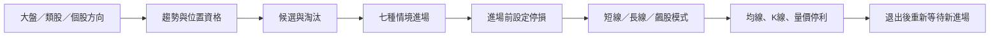
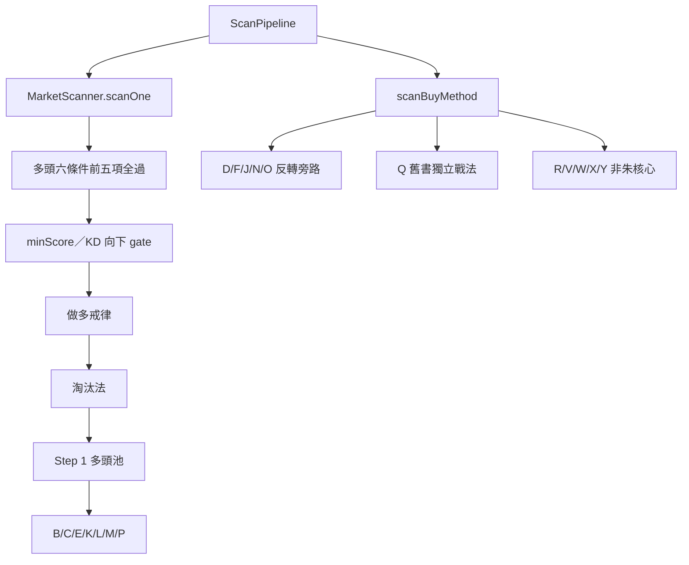

# 2026-08-06 朱家泓課程、Cloud 整理與 RockStock 正式執行鏈交叉稽核

## 0. 結論先行

本輪不是從 Cloud 筆記再摘要一次，而是先獨立走完教材，再回頭比 Cloud，最後沿 RockStock 目前實際呼叫鏈核對。

總結如下：

1. **Cloud 的逐課整理整體完整，不能說整理錯。**它的強項是頁面覆蓋、規則摘錄、歷史缺口追蹤與大量實作紀錄。
2. **Cloud 文件集不能直接當單一 canonical truth。**同一資料夾同時留有早期未完成、後期補掃、回測裁決與舊 production 宣稱；不看文件日期與 runtime，會把歷史判讀當現況。
3. **本次獨立重讀修正了 Codex 前一版的一個過度判定。**K 線橫盤並非單純 off-by-one：主課影片與較新合訂講義／直播的最短根數不同，應標 `source_conflict`，最新版 production 預設才採「三根含第一根、第四根突破」。
4. **現行做多 scanner 大方向完整，但把「候選品質池」與「七種進場位置」部分混在一起。**B/C/E/K/L/M/P 必須先通過多頭六條件核心池；D/F/J/N/O、Q 與自創策略則走不同旁路。
5. **現行做空是最高風險缺口。**正式空頭候選要求每一筆都要前日量比 ≥1.3，但課程 S1、S5 明說不一定要量；七個空方位置 detector 雖已存在，卻沒有接到正式空方 scanner。
6. **目前使用者真正看到的持倉主建議沒有遵守已保存的 `operationMode`。**`daily-action` 與手機推播走固定 MA5／10／20 獲利分支；較完整的 `v12-signals` API 會讀短／長線模式，但 repository 內未找到前端直接消費它。
7. **RockStock AI 尚未載入最新課程規格。**聊天 context 仍只讀兩份舊書整理，所以「筆記已整理」不等於 AI 或 production 已採用。

因此目前最需要的不是再產生一份無來源的「總整理」，而是把每一條規則拆成：

```text
教材原文與版本
→ 適用方向／週期／戰法
→ 是否要收盤確認
→ RockStock 的量化值
→ 正式執行路徑
→ 若不同，是缺陷、來源衝突，還是回測後覆寫
```

本報告不修改交易邏輯；只校正 canonical 文件與列出可驗收的落地順序。

## 1. 本輪實際覆核範圍

### 1.1 線上課程與最新講義

- 75 支 MP4。
- 75 份 SRT，逐一用課號／標題配對；沒有缺整堂字幕。
- 75 份文字逐字稿與對應投影片抽圖資料。
- 170 個 PDF 檔包含單課、合訂本、拆檔與 OCR／壓縮副本，不能把 170 當成 170 份獨立教材。
- 最新上冊合訂講義 234 頁；下冊 216 頁。
- 另讀 2026-07-01 學員直播 QA。

字幕完整性檢查以影片長度對 SRT 最後時間碼核對；最大尾差約 38.5 秒，抽查皆屬片尾或無對白段，未發現整章缺漏。這能證明語料配對完整，不代表自動字幕每一個同音字都正確；數字與關鍵句仍以投影片、前後文與影片互證。

### 1.2 六本書

| 層級 | 書籍 | 本輪用途 |
|---|---|---|
| P1 | 朱家泓《活用技術分析寶典》825 頁 | 最新完整百科、五步驟與進出場位置補充 |
| P2 | 朱家泓《做對 5 個實戰步驟》338 頁 | 選股、進場、停損、操作、停利 SOP |
| P3 | 朱家泓《抓住 K 線》330 頁 | K 棒與反轉組合的歷史版本 |
| P3 | 朱家泓《抓住線圖》337 頁 | 趨勢、均線與智慧 K 線戰法 |
| P3 | 朱家泓《抓住飆股》351 頁 | 飆股、型態與歷史操作細則 |
| T1 | 林穎《學會走圖 SOP》292 頁 | 走圖訓練與共同教學系統驗證 |

### 1.3 Cloud 整理與 RockStock

Cloud 端覆核：

- `筆記/CH1` 至 `CH12`。
- `00-總綱.md`。
- `90-rockstock缺口待辦.md`。
- `91-rockstock實作計畫.md`。
- `98-課程vs書本差異.md`。
- `99-V12差異報告.md`。
- `直播課/2026-07-01-學員QA.md`。

RockStock 端不是依檔名猜「新版」，而是從以下正式入口往下追：

- 選股：`ScanPipeline → MarketScanner`。
- 做空候選：`MarketScanner.scanShortCandidates → scanOneShort`。
- 買法：`MarketScanner.scanBuyMethod`。
- 持倉主建議：`/api/portfolio/daily-action → holdingsActionEngine`。
- 手機推播：`/api/cron/portfolio-notify → daily-action`。
- 另一套持倉 API：`/api/portfolio/v12-signals`。
- AI 教材：`lib/ai/bookContextLoader.ts`。

## 2. 本次獨立整理出的 canonical 骨架

### 2.1 系統不是一組條件，而是有順序的狀態機



不得把後項倒過來推翻前項。例如單根紅 K、KD 金叉或爆量不能讓空頭股票自動變成可做多；「選到候選」也不等於「今天已可買」。

### 2.2 基礎判別點

| 面向 | 獨立重讀結論 | 實作禁忌 |
|---|---|---|
| 趨勢 | 多頭必須頭頭高、底底高；空頭必須頭頭低、底底低；只破壞一側先歸盤整。高低點用影線定位，突破／跌破用收盤確認。 | 不可只用均線交叉代替完整趨勢。 |
| K 棒分類 | 現行課程長／最大棒 >6.5%，中棒 3.5%–6.5%，小棒 <3.5%；十字／變盤線另有極小實體語意。 | 6.5% 是分類，不是所有進場棒最低門檻。 |
| 進場棒 | 多個高勝率位置用紅／黑 K 實體約 ≥2% 作可操作棒。 | 不可與 6.5% 合成一個常數。 |
| 均線 | MA5／10／20／60 對應不同持有週期；做多主要在上彎 MA20 上，做空鏡像。 | 不可在持倉後任意換守線。 |
| 成交量 | 基本量看 5 日均量；攻擊量約 1.2–1.3×avg5；爆量約 ≥2×avg5；窒息量約前一日一半以下。部分進場棒另比較前日量 1.2 或 1.3。 | 必須保存 denominator；不能只存 `volumeRatio=1.3`。 |
| 確認時間 | 大部分突破、跌破、均線、停損與停利用收盤前確認；直播常用約 13:00–13:25 執行。 | 次日開盤是特定轉折的早期強弱警示，不是所有形態的正式確認。 |

### 2.3 選股與部位

獨立重讀後的選股順序是：

1. 先看大盤與類股方向。
2. 趨勢。
3. 位置。
4. K 線轉折。
5. 均線。
6. 成交量。
7. 指標只作最後確認。
8. 再用淘汰法排除高檔、壓力、背離、空頭或看不懂的股票。
9. 建立約 20–30 檔鎖股觀察名單，實際集中約 2–5 檔；數字依主課與直播語境可有範圍差異。

2026-07-01 直播補充的資金原則：

| 市況與方向 | 教學配置上限／區間 |
|---|---:|
| 大盤大多頭做多 | 約 70%–80% |
| 高檔盤整 | 約 50% |
| 大盤空頭仍逆勢做多 | 不超過 30% |
| 空頭第一段做空 | 約 50% |
| 空頭第二波順勢做空 | 約 60%–80% |
| 低檔打底後仍做空 | 降至約 50% |
| 趨勢反向操作 | 約 20%–30% |

這些是教學風控配置，不等同已回測的最佳槓桿；若上線要另存 `education_allocation` 與 production cap。

### 2.4 做多與做空七位置

| 編號 | 做多位置 | 主要確認 |
|---|---|---|
| L1 | 盤整突破 | 大量中長紅 K 收盤突破上頸線 |
| L2 | 回後買上漲 | 多頭淺回、不破關鍵低點／MA20，紅 K 再發動 |
| L3 | K 線橫盤突破 | 固定第一根 K 高低為錨；根數存在版本衝突 |
| L4 | 底部型態確認 | 頭肩底、複式頭肩底、N 字、三重、圓弧、一字等依最新版集合確認 |
| L5 | ABC 修正突破 | 原多頭修正後收盤突破下降切線／關鍵高 |
| L6 | 突破上升軌道線 | 多頭加速，收盤突破上軌 |
| L7 | 突破飆股大量黑 K 高點 | 1–3 日內紅 K 收盤過洗盤黑 K 高 |

| 編號 | 做空位置 | 主要確認／量能 |
|---|---|---|
| S1 | 彈後空下跌 | 空頭反彈不過前高，中長黑破前日低與 MA5；不要求全域大量 |
| S2 | 盤整跌破 | 中長黑收盤跌破下頸線 |
| S3 | K 線橫盤跌破 | 固定第一根 K 高低為錨；與 L3 同一根數版本衝突 |
| S4 | 頂部型態確認 | 收盤跌破頸線，日週線分開 |
| S5 | ABC 反彈跌破上升切線 | 黑 K 破反彈切線；主課口述不要求量，講義圖題另有大量語意 |
| S6 | 跌破下降軌道線 | 大量中長黑跌破下軌，空方加速 |
| S7 | 下跌飆股反彈紅 K 低點跌破 | 1–3 日內黑 K 收破紅 K 低；量能來源互相衝突 |

七位置是「觸發原因」，趨勢、MA20、位置與停損是「情境底座」。兩者應分層，不應用一組全域六條件把所有位置先刷掉。

### 2.5 停損、持倉與停利

- 停損在進場前決定，以收盤確認；固定比例常用 5%，另有結構低／高點停損，絕對損失不可放任超過 10%。
- 停損只能往有利方向收緊，不能放寬。
- 尚未獲利時是停損；有一定獲利後才轉為移動停利。課程多處以約 7% 作狀態切換例子。
- 短線通常守 MA5；長線需日線四線多排與週線配合後守 MA20。
- 飆股一般辨識沿 MA5，但 CH6-15 明列的飆股專用操作還會看 MA3、趨勢線、前低與爆量黑 K；MA3 與 MA5 不能合成同一條規則。
- CH8 的「不到 +10% 首次破 MA5 可續抱」有附加條件：固定停損仍在；若下一次反彈不過高、趨勢轉盤整／轉弱就要出。
- +10% 的達標是進場後曾在盤中觸及，不是出場日收盤仍需保有 +10%。
- CH8 多單急漲／高獲利反轉使用 20% 情境；CH8 空單是 15%；CH9 多單高檔爆量反轉又是 >15%。三者不能共用一個全域門檻。
- CH9 多單高檔爆量長黑／長上影，未破昨低且獲利 >15% 時先賣一半；次日下跌賣完；吞噬可當日全出。

## 3. 六本書與 2026 課程的規則演進

| 主題 | 舊版書籍 | 2026 課程／較新資料 | canonical 處理 |
|---|---|---|---|
| K 棒長中小 | 《抓住 K 線》長約 ≥4.5%、中約 2.5%–4.5% | 長 >6.5%、中 3.5%–6.5%、小 <3.5% | 新分類優先；舊值只保留版本史 |
| 進場可操作棒 | 舊書與寶典常見實體 ≥2% | 課程特定進場也使用約 2% | 與 6.5% 分欄保存 |
| 固定停損 | 《抓住線圖》曾使用最大約 7% | 新課常用 5%，絕對底線 >10% 必走 | 5% 為一般預設；策略／舊書例外明示 |
| 大量比較基準 | 寶典多處前日 ×1.3 | 課程同時存在前日 ×1.2／1.3 與 avg5 ×1.2–1.3 | 每條規則保存 denominator 與章節 |
| 進場位置數 | 寶典有較多歷史位置／秘籍圖 | 2026 主課整理為多空各七位置 | 七位置為 P0 核心；舊書策略另建 track |
| 林穎體系 | 走圖 SOP 獨立成書 | 與朱老師趨勢、K、量、均線邏輯高度一致 | 視為共同教學與訓練細化，不稱「完全不同體系」 |

舊書不是錯誤，而是版本與補充層。只有在新課沒有覆蓋且不衝突時，才可補入核心；若是獨立舊書戰法，必須在 UI 標清來源。

## 4. 教材內部必須保留的衝突

### 4.1 K 線橫盤根數

| 來源 | 規則 |
|---|---|
| CH6-3／CH6-10 主課影片 | 一根錨點後再數一、二、三根，之後才突破／跌破；最短是第 5 根觸發 |
| 最新下冊合訂講義 | 三天包含第一天，第四天突破 |
| 2026-07-01 直播 | 三根以上，包含最高那一根；明天、後天不破高低，第四天過高即算 |

裁決：`source_conflict`。按使用者「最新講義／課程優先」的原則，production 預設採用 3 根總數，但舊影片版本應保留為 `legacy_main_video` 做 shadow 比較。

### 4.2 S7 量能

- 主課影片明確描述大量反彈紅 K，之後大量中長黑跌破。
- 較新講義同頁又出現「大量中長黑」與「有量或無量均可」。

裁決：`source_conflict`。在沒有使用者裁決或回測前，量能應作為觀測欄位，不應成為所有 S7 的 hard gate；UI 必須顯示命中的是哪一版。

### 4.3 S5 量能

- 講義標題／圖像有大量語意。
- 主課逐字明確說這一種做空不一定要大量。

裁決：保存 `volume_optional` 與來源，不可被正式空頭池的全域 1.3 先排掉。

### 4.4 隔日開盤與隔日確認

「關鍵轉折位置，次日開盤定強弱」是 CH2-9 的早期觀察；多數型態真正成立或失效，仍需後續收盤突破／跌破關鍵高低。Cloud 的「所有變盤線都看次日開盤」適合作提醒，不應建成 universal confirmation gate。

## 5. 與 Cloud 整理的交叉結論

### 5.1 Cloud 做得好的部分

- CH1–CH12 的逐課、逐頁與逐字層覆蓋很完整。
- 正確區分 avg5 的基本量／攻擊量／爆量／窒息量。
- 正確記錄 CH8 未滿 +10% 的 MA5 特例及 CH8 20%／CH9 15% 情境差異。
- 已發現 K 橫盤最新講義的「三根含第一根」。
- 已累積大量代碼 grep、回測與缺口關閉記錄，對歷史追蹤有價值。
- 後期 `90-rockstock缺口待辦.md` 確實補做了六本書掃描，不能只根據 `98` 的早期待辦說 Cloud 沒看書。

### 5.2 與獨立整理不同或需要降級的地方

| 項目 | Cloud 文件表現 | 本輪判定 |
|---|---|---|
| 書本完成度 | `98` 仍寫完整 page 級對照待補；`90` 後段又寫六本書全掃完 | 文件集內部時點不同；必須以記錄日期與證據清單判讀 |
| K 橫盤 | 後期採三根含錨點，有時把另一版當舊錯誤 | 主課影片確有另一種數法；應保留來源衝突，不只留裁決值 |
| 次日確認 | `98` 寫所有變盤線看次日開盤 | 過度全域化；開盤是早期強弱，正式確認多為收盤過關鍵位 |
| 來源優先 | `00` 傾向最新投影片永遠為準 | 同一最新生態可自相衝突；還需要 conflict state、時間與人工裁決 |
| 林穎體系 | 個別早期文字稱可能完全不同 | 六本書與課程互證後不成立；較合理是共同核心下的走圖訓練細化 |
| 已實作標籤 | 多處依據函數名、註釋或當時 grep 寫「已實作」 | 只能當歷史快照；必須重新沿 production caller 驗證 |
| `99-V12差異報告` | 早期局部審計 | 已過時；不能代表當前 runtime |
| 回測裁決 | 與教材摘錄混在同一大 ledger | 應獨立為 `production_override`，不能反向改寫教材原意 |

這不是「Cloud 不可靠」，而是它同時扮演了筆記、工單、實驗記錄、實現報告與決策日誌五種角色。若不拆層，換任何模型都可能讀出不同答案。

## 6. RockStock 正式程式交叉檢查

### 6.1 實際選股鏈



已確認：

- B/C/E/K/L/M/P 必須先通多頭 Step 1 池。
- D/F/J/N/O 繞過 Step 1，只顯示部分做多禁忌，不是同一套 hard gate。
- Q 也繞過 Step 1。
- R/V/W/X/Y 是 RockStock 自創／補充策略，不應混入 `zhu_core` 成效。
- `v12StockEvaluator.ts` 名稱雖新，但不是正式 scanner 主入口。

因此「玄虎／字母策略有 detector」不等於它與朱老師課程七位置完全等價，也不等於 production 已通過同一組選股條件。

### 6.2 多頭六條件的語意混用

正式 `evaluateSixConditions` 把趨勢、完整 MA 多排、位置、成交量與 K 棒設為五個必要條件，再讓指標加分。這個框架方向合理，但有兩個風險：

1. 全域位置另加 MA20 乖離 <15%；該 15% 在課程主要來自葛蘭碧逆勢情境與高乖離警示，不是所有順勢位置的 P0 通用 gate。
2. 主池量能讀 config 預設約前日 1.2；個別 detector 又用前日 1.3；CH4 定義則常看 avg5。行為可以並存，但當前命名與註釋容易讓維護者誤以為只有一個「大量」。

### 6.3 做空正式路徑：確認缺陷

`scanOneShort` 只調用 `evaluateShortSixConditions`，並硬性要求：

- 空頭趨勢。
- MA5 < MA10 < MA20，MA5 下彎。
- 收盤在 MA10／20 下，乖離 <15%。
- 黑 K。
- 黑 K 實體 ≥2%。
- 今日量 ≥前日 1.3。

但 `detectShortEntries` 的 S1–S7 只由走圖組件與回測腳本調用，沒有進入正式 `scanOneShort`。所以當前正式結果是「嚴格空頭品質池」，不是「朱老師七空點」。

具體後果：

- S1、S5 的無量有效形態被全域量 gate 先刪除。
- 每筆候選沒有 S1–S7 `entry_reason`，無法解釋今天究竟是哪一種空點。
- S7 detector 本身要求反彈紅 K 大量，但沒有 hard require 突破黑 K 大量；detail 卻固定寫成「大量中長黑」，顯示與判定不一致。
- S3 採用主課影片的錨點後 3 根版本，未採最新講義／直播預設。

### 6.4 買入訊號的主要判斷

| 面向 | 狀態 | 判定 |
|---|---|---|
| 趨勢／MA20 基礎 | 大部分已做 | `mostly_complete` |
| 多頭七位置 detector | 七個核心位置大致存在 | `mostly_complete`，但夾有舊書與自創門檻 |
| 反轉軌 | D/F/J/N/O 獨立旁路 | 產品架構，不是課程七位置共同 gate |
| K 橫盤 | 採用主課影片版根數 | `source_conflict`，不是純 bug |
| 型態集合 | N 含課程外舊書型態與未經校準達成率 | `partial`／呈現風險 |
| M/N/O 真突破 ×3% | 舊書 overlay | `production_quantization`，非最新課通用原文 |
| 排序 | 當日漲幅、分數、MA20 斜率等 proxy | 非課程「接近發動」的完整實現 |
| 鎖股 | 主要持久化於少數字母路徑 | 與課程 20–30 檔跨日汰弱架構仍有差距 |

### 6.5 賣出訊號與提示：主路徑不一致

持倉資料已保存：

- `triggerSignal`。
- `operationMode: short | long`。
- `positionSide: long | short`。

但 `daily-action` 只把 `triggerSignal` 與 `positionSide` 傳給 `evaluateHolding`，沒有傳 `operationMode`。長倉引擎固定按下列順序判斷：

- 獲利 ≥20% 且破 MA20 → 全出。
- 獲利 ≥10% 且破 MA10 → 全出。
- CH8／CH9 的爆量、吞噬、前低與趨勢訊號。
- 獲利 ≥20% 且破 MA5 → 全出。
- 獲利 ≥10% 且破 MA5 → 減半。

這並不等價於課程的「持倉一開始選短線守 MA5，升級長線後守 MA20」。例如 B 部位已切長線、獲利 12%、跌破 MA10 但仍在 MA20 上，課程模式應繼續守 MA20；當前 `daily-action` 可直接全出。

`/api/portfolio/v12-signals` 會讀取 `operationMode` 並選 MA3／5／10／20，也計算動態停損與升級資格；但 repository 內沒有前端 fetch 它。主頁面的「今日操作建議」與手機通知都依賴 `daily-action`，所以較完整邏輯沒有成為主路徑。

另有兩個明確的教材／production 分流：

- 進場後曾盤中觸及 +10%，之後破 MA5：課程要停利；當前主引擎仍看出場日收盤獲利是否 ≥10%，`daily-action` 只加 advisory。
- 連漲超過 3 天且約 +10% 後黑 K 破昨低：課程可用 K 線戰法出場；回測顯示較能賠少但會少賺，因此目前只提示，不改 hard action。

這兩項應標 `production_override`，不是靜默稱為「課程已完全實作」。

### 6.6 AI 知識沒有接上最新版

`lib/ai/bookContextLoader.ts` 當前只載入：

```text
docs/TECHNICAL_ANALYSIS_5STEPS.md
docs/RockStar_5Steps_Framework_v12.md
```

沒有載入 2026 課程 canonical spec，也沒有載入本次衝突表。所以目前問 RockStock AI「朱老師怎麼說」，答案仍可能來自舊書或舊整理。

## 7. 問題分級

### P0：會直接改變主要買賣建議

1. `daily-action`／推播不遵守 `operationMode`。
2. 正式空方 scanner 沒接 S1–S7，並錯誤使用全域量 1.3 gate 代表全部空點。
3. 主出場引擎與課程 +10%「曾觸及」事件定義不同，目前只提示。

### P1：知識汙染或高概率造成不同模型不同結論

1. AI loader 未讀取最新 canonical spec。
2. K 橫盤根數缺少雙版本狀態，代碼註釋還宣稱已「4→3」但行為仍是錨點後 3 根。
3. S7 detector 的實際量 gate、detail 與教材衝突沒有統一表示。
4. `bookThresholds.ts` 仍把書本排在課程前，並保留誤導性舊註釋／未使用常數。
5. Cloud 歷史 `已實作`、舊 V12 報告與當前 runtime 沒有版本綁定。

### P2：部分覆蓋、自創量化或呈現問題

1. 淘汰法原因碼未完整保存；很多股票只留下 `filteredOut`。
2. N 軌型態集合、達成率與 2026 課程六型沒有分層。
3. 15% 乖離、5% 橫盤寬度、多個回看窗屬於產品量化。
4. 選股 universe 與排序是流動性／回測 proxy，不是課程原始流程的一對一實現。
5. CH11 績效目標與圖例勝率不能當預測事實。

## 8. 建議落地順序

### Phase 0：先建立單一可審計知識層，不動交易結果

1. 將 `docs/ZHU_TECHNICAL_KNOWLEDGE_SPEC_2026.md` 設為教材 canonical，Cloud 逐課筆記作 evidence library，舊書整理作補充。
2. 每條規則保存 `source_version`、`direction`、`denominator`、`confirmation_time`、`implementation_caller` 與 `production_override`。
3. 對 K 橫盤、S5、S7 建 conflict registry；UI 與日誌顯示實際採用版本。
4. 將「課程原意」和「回測裁決」分開，不再寫進同一個狀態欄位。

### Phase 1：統一持倉主狀態機

1. 讓 `daily-action` 讀取 holding 的 `operationMode`。
2. 將 active operation MA、動態停損、+10% touched 狀態與分批狀態持久化。
3. `SignalSummaryCard`、daily action、realtime guard、手機推播與 shadow ledger 共用同一 action engine。
4. 對現有持倉先做 shadow diff，不直接切換 production 動作。

### Phase 2：重接空方七位置

1. 正式空頭路徑拆成 `short_quality_context` 與 `short_entry_reason`。
2. S1–S7 至少一項命中才可稱「課程空點」；否則只叫空頭觀察池。
3. 移除全域量 1.3 gate，量能交給各 S 規則。
4. S5／S7 同時跑有量版與量可選版，統計候選量、勝率、尾損與 train/test 穩定性。

### Phase 3：逐項 shadow／回測來源衝突與自創門檻

- K 橫盤 3 根總數 vs 錨點後 3 根。
- 一般進場 MA20 乖離 15% 是否該全域 hard gate。
- M/N/O 真突破 3%。
- 各 detector 前日量 1.3 vs 課程情境量。
- 選股排序的當日漲幅 vs launch readiness。

每次只改變一個維度，並保留教材版、現行版、樣本外結果與最後裁決。

### Phase 4：最後才更新 AI 與使用者文案

1. AI 先讀 canonical spec，再按需讀取 Cloud 逐課 evidence 與舊書。
2. UI 每個買賣提示顯示 `rule_id + source tier + adopted version`。
3. 對 production override 明示「系統回測策略」，不要寫成「朱老師原文」。

## 9. 驗收標準

完成後至少要通過下列 contract：

1. 同一 holding state 在持倉頁、詳細圖、daily action、手機推播與 shadow ledger 給出相同主動作。
2. 升級長線的部位不會因 MA5／MA10 被短線主規則提前退出，除非命中獨立的趨勢／爆量全出例外。
3. 每一筆正式空方候選有 S1–S7 reason；無 reason 者清楚標為觀察池。
4. 1.2、1.3、2 倍量比都附 denominator 與章節。
5. 2%、3.5%、6.5% 不跨 K 棒分類與進場觸發共用。
6. K 橫盤結果顯示採用 `latest_handout_3_total` 或 `main_video_anchor_plus_3`。
7. AI 回答可指出教材衝突，不會只給單一偽精確答案。
8. 任何回測覆寫都能同時顯示教材原版與 production 版。

## 10. 最終判斷

Cloud 與 Codex 真正的差異，不在誰能抄出更多規則，而在是否把「來源版本、適用情境與正式 caller」綁定在一起。

現在最可信的共同結論是：

- 趨勢、K、均線、量價、做多七位置與大部分停損停利知識已經進入 repository。
- 最大缺口不是知識總量，而是**正式路徑沒有統一使用同一份知識**。
- 做空七位置、持倉 operation mode 與 AI 最新 context 是最優先的三條主線。
- K 橫盤、S5、S7 必須保留衝突狀態；不能再讓任何模型替老師悄悄選邊後寫成唯一真相。

配套 canonical 文件：[朱家泓技術分析知識規格（2026 課程基準版）](../ZHU_TECHNICAL_KNOWLEDGE_SPEC_2026.md)。
